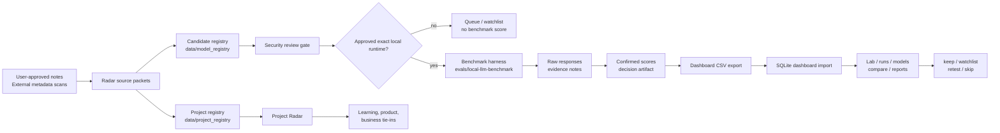

# AI Lab OS v1 Architecture

AI Lab OS is split into two related lanes:

- the local RAG/provider app
- the model evaluation dashboard loop

The v1 product focus is the dashboard loop.



## Core Boundaries

- Radar creates leads, not scores.
- Security review approves or blocks download/run decisions.
- Benchmark artifacts preserve source evidence.
- Confirmed scores are separate from draft/local-judge suggestions.
- Dashboard import reads CSV artifacts into local SQLite.
- Demo fixture rows are examples only and are hidden from real views by default.

## Data Flow

```text
automations/ai-lab-radar/inputs
  -> automations/ai-lab-radar/reports
  -> data/model_registry/candidates.csv
  -> automations/ai-lab-radar/security-reviews
  -> data/eval_results/<benchmark_run_id>
  -> data/eval_results/<benchmark_run_id>/dashboard-import/*.csv
  -> apps/model-dashboard local SQLite database
```

## Runtime Policy

The system can talk to local runtimes only when explicitly configured:

- LM Studio CLI or loopback/private-LAN endpoint
- Ollama local inventory or endpoint
- llama.cpp local server
- MLX/MLX-LM local execution path

The repo must not add hidden cloud calls, model download logic, API SDKs,
secrets, or automatic installs as part of radar or dashboard views.

## v1 Release Gate

`v1.0.0` should be tagged only when one of these is true:

- a second real confirmed model benchmark is captured and imported; or
- the release is explicitly defined as a single-model baseline with Qwen3 Coder
  as the initial benchmark evidence.
