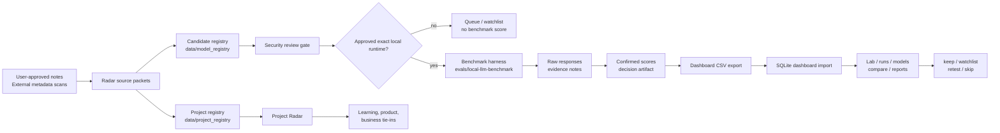

# Architecture

`local-ai-lab` / AI Lab OS is a local-first Apple Silicon AI engineering lab.
The architecture optimizes for private local workflows, reproducible
experiments, and clean future portability without hidden cloud calls.

This is the canonical architecture document. The root `ARCHITECTURE.md` and
`docs/architecture-v1.md` are compatibility pointers to this file.

## Hardware Target

- Apple Silicon Mac Studio.
- 256 GB unified memory.
- Large local storage.
- Local-first and privacy-first workflows.

## Product Lines

### Local RAG Backbone + Provider Harness

```text
CLI / FastAPI
  -> ingestion
  -> chunking
  -> Qdrant retrieval
  -> prompt assembly
  -> local model provider
  -> answer + citations
```

This lane provides the local app scaffold, provider abstractions, CLI/FastAPI
entry points, deterministic test providers, Qdrant integration, and doctor
checks.

### AI Lab OS Dashboard Loop

```text
radar candidate
  -> security review gate
  -> benchmark artifact
  -> raw responses
  -> draft/confirmed scores
  -> dashboard import
  -> compare models
  -> keep/watchlist/retest/skip decision
```

This lane provides the local model dashboard, candidate registry, project
registry, benchmark harness, scoring artifacts, reports, and lab workflow views.

## Repository Shape

AI Lab OS is one repo while the tools remain tightly coupled. Shared data lives
under `data/`, reusable operating patterns live under `skills/`, and design
decisions/evidence live under `docs/`.

```text
apps/model-dashboard/          Local model performance dashboard
src/local_ai_lab/              Local RAG/provider app and ai-lab CLI
automations/ai-lab-radar/      Radar inputs, reports, and guardrails
evals/local-llm-benchmark/     Personal local LLM benchmark suite
data/model_registry/           Approved model candidate registry
data/project_registry/         GitHub/project opportunity registry
data/eval_results/             Benchmark artifacts and dashboard CSV exports
skills/                        Reusable AI workflow skills
docs/                          Architecture, ADRs, roadmap, lab notes, evidence
tests/                         Local RAG/provider app tests
scripts/                       Smoke checks and utility scripts
```

Split a component into its own repo only when it becomes portfolio-ready, needs
separate deployment, or needs a different security boundary.

## Dashboard And Benchmark Flow



## Runtime Boundaries

Docker is used for local infrastructure services only:

- Qdrant.
- Optional Open WebUI.

Model runtimes stay native on macOS:

- Ollama.
- LM Studio OpenAI-compatible server or LM Studio CLI.
- MLX / MLX-LM.
- llama.cpp.

Open WebUI is optional and parallel. The FastAPI RAG harness must not depend on
Open WebUI.

The system can talk to local runtimes only when explicitly configured. The repo
must not add hidden cloud calls, model download logic, cloud API SDKs, secrets,
telemetry, or automatic installs as part of radar, dashboard views, or benchmark
planning.

## Python Boundary

The Python application uses:

- `uv`.
- `pyproject.toml`.
- `uv.lock`.
- `.python-version`.
- `.env.example`.

The CLI and FastAPI harness stay native through `uv`. Dashboard-only validation
can use stdlib `unittest` and the smoke script without starting Qdrant or a
model runtime.

## Core Data Boundaries

- Radar creates leads, not scores.
- Security review approves or blocks download/run decisions.
- Benchmark artifacts preserve raw responses and evidence notes before scoring.
- Confirmed scores are separate from draft/local-judge suggestions.
- Dashboard import reads local CSV artifacts into local SQLite.
- Demo fixture rows are examples only and are hidden from real views by default.
- `data/dashboard/*.sqlite` is runtime state, not source truth.

## Current Dashboard Storage

The dashboard uses `data/dashboard/model_dashboard.sqlite` as local runtime
state. Fixture CSVs live in `apps/model-dashboard/fixtures` and can recreate a
demo database at any time.

Benchmark artifacts flow through:

```text
automations/ai-lab-radar/inputs
  -> automations/ai-lab-radar/reports
  -> data/model_registry/candidates.csv
  -> automations/ai-lab-radar/security-reviews
  -> data/eval_results/<benchmark_run_id>
  -> data/eval_results/<benchmark_run_id>/dashboard-import/*.csv
  -> apps/model-dashboard local SQLite database
```

## v0 Constraints

- Keep abstractions simple and testable.
- Avoid framework sprawl.
- Do not add agents, graph RAG, MCP, browser automation, voice, auth, cloud
  deployment, or fine-tuning implementation yet.
- Document future cloud portability before implementing it.

## Release Gate

`v1.0.0` should be tagged only when one of these is true:

- a second real confirmed model benchmark is captured and imported; or
- the release is explicitly defined as a single-model baseline with Qwen3 Coder
  as the initial benchmark evidence.

## Architecture Governance

- `AGENTS.md` is the operating agreement for all agents.
- ADRs in `docs/adr/` record architecture decisions.
- Architecture direction must not change without a new ADR.
