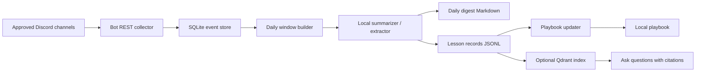

# Discord Trading Learning Assistant

Status: proposal / engineering design

## Purpose

Build a local-first daily learning assistant for selected Discord channels in a
stock-trading community. The assistant should summarize what happened, extract
repeatable lessons, and maintain an evolving playbook of the channel owner's
trading process, discipline rules, tools, and market-context checks.

The first useful product is not a trade copier. It is an educational digest and
research notebook for S&P day-trading study.

## Boundaries

### Approved Scope

- Read only explicitly approved Discord guild and channel IDs.
- Use an official Discord bot/API access path approved by the server owner or
  moderators.
- Summarize messages, links, screenshots posted in-channel, and threaded
  context when the bot has permission to read them.
- Generate local daily Markdown digests and lesson records.
- Build an evolving local playbook of recurring rules, setups, mistakes,
  terminology, tools, and decision criteria.
- Generate paper-trading hypotheses and journaling prompts.
- Use local AI Lab OS providers for summary and extraction where possible.

### Out Of Scope

- Browser control, screenshot scraping, OCR scraping, password automation, or
  self-bot behavior for unattended collection.
- Live trading, order placement, broker automation, trade mirroring, or
  financial advice.
- Downloading models, calling model APIs, adding cloud API clients, or adding
  secrets beyond the explicit Discord bot token.
- Registering Discord-derived lessons as model eval scores or radar candidates.
- Capturing channels, DMs, or private content outside the user-approved allowlist.

## Policy And Access Model

Discord should be accessed through an official bot account created in the
Discord Developer Portal and installed into the specific server with the minimum
permissions required for the selected channels.

References to verify before implementation:

- Discord self-bot policy:
  https://support.discord.com/hc/en-us/articles/115002192352-Automated-user-accounts-self-bots-
- Discord privileged intents overview:
  https://support-dev.discord.com/hc/en-us/articles/6207308062871-What-are-Privileged-Intents
- Discord bot getting-started docs:
  https://docs.discord.com/developers/quick-start/getting-started

Daily unattended browser automation is rejected for this project. A one-off
user-guided screen review can be useful for understanding the UI or a specific
message, but it should not become the ingestion mechanism.

If the server owner or moderators will not approve a bot, there is no unattended
daily collector for that server. The fallback is manual source capture: the user
copies selected messages, links, or notes into a local file and the assistant
turns that approved source packet into a digest and playbook update.

## Product Output

Each daily run should produce one Markdown digest under a local, ignored or
explicitly reviewed output path such as:

```text
data/discord_learning/digests/YYYY-MM-DD.md
```

The digest should include:

- top discussions and market themes;
- repeated trading rules or discipline notes;
- setups mentioned, including entry context, invalidation, and risk language;
- tools, indicators, tickers, contracts, timeframes, platforms, and data feeds
  referenced;
- lessons learned from winning, losing, missed, or avoided trades;
- disagreements, uncertainty, and claims that need verification;
- links/resources shared in-channel;
- a "teach me" section that explains unfamiliar concepts plainly;
- paper-trading exercises for the next session.

The assistant should also maintain a playbook file:

```text
data/discord_learning/playbook.md
```

The playbook is a cumulative synthesis. It should cite the date and source
channel for each durable lesson, avoid overfitting to one message, and clearly
separate confirmed recurring patterns from one-off observations.

## Architecture



## Codex Build Path

Codex can build almost the whole automation inside this repo. The practical
division is:

| Can be built here | Must come from outside Codex |
| --- | --- |
| Collector modules and CLI commands | Discord server owner/moderator approval |
| SQLite schema and migrations | Discord bot token and channel allowlist |
| Fixture-based tests with no live Discord calls | Message-content intent approval if required |
| Daily digest generator | User review of first real digests |
| Lesson extraction prompts and mock-provider tests | Local model runtime availability |
| Playbook updater and citation format | Decision on raw-message retention |
| Local scheduler runbook | Mac awake/network availability at run time |
| Privacy checks and `.gitignore` updates | Any paid Discord/community membership |

Recommended repo shape for implementation:

```text
src/local_ai_lab/discord_learning/
  __init__.py
  collector.py
  store.py
  digest.py
  lessons.py
  playbook.py
  cli.py

tests/
  test_discord_learning_collector.py
  test_discord_learning_store.py
  test_discord_learning_digest.py
  fixtures/discord_messages.json

data/discord_learning/       ignored runtime state
docs/ideas/discord-trading-learning-assistant.md
```

The first Codex-built milestone should use fixture data only. The second
milestone can run a live Discord fetch only after the user provides a local
token and channel IDs outside Git.

## Components

### Collector

The MVP collector should poll the Discord REST API for approved channel IDs and
write normalized message records into SQLite. Polling avoids a WebSocket client
dependency for the first version.

Required collector behavior:

- read `DISCORD_BOT_TOKEN` only from local environment or an OS keychain-style
  secret store;
- allowlist guild and channel IDs;
- persist Discord snowflake IDs for dedupe and pagination;
- obey Discord rate-limit responses;
- record fetch windows and failures without logging message content;
- skip messages from unapproved channels even if the bot can technically see
  them.

Potential dependency review:

- Start with Python stdlib `urllib.request`, `json`, `sqlite3`, and `time`.
- Add a Discord client library only if REST polling becomes insufficient.
- If a library is accepted, document exact import locations, transitive risk,
  and removal plan before changing `pyproject.toml`.

### Store

Use local SQLite for raw event records and derived lesson state.

Suggested tables:

```text
discord_messages
  message_id text primary key
  guild_id_hash text
  channel_id text
  channel_name text
  author_id_hash text
  author_display text
  created_at text
  edited_at text null
  content text
  attachment_count integer
  link_count integer
  raw_json text
  fetched_at text

discord_fetch_state
  channel_id text primary key
  last_message_id text
  last_fetched_at text
  last_status text

lesson_records
  lesson_id text primary key
  digest_date text
  channel_id text
  lesson_type text
  claim text
  evidence_message_ids text
  confidence text
  created_at text
```

Privacy default: raw message content is local data. Do not commit it. Keep it
under `data/discord_learning/` and add that runtime path to `.gitignore` before
implementation if it is not already ignored.

### Extractor

The extractor turns a daily message window into structured learning records.
The local model prompt should ask for:

- trading setup;
- market context;
- risk rule;
- discipline rule;
- tool/platform/indicator;
- mistake to avoid;
- concept to study;
- quote-worthy lesson, paraphrased unless exact wording is necessary;
- evidence message IDs;
- confidence: `low`, `medium`, or `high`.

It must not infer that a strategy is profitable. It should write "claim needs
verification" when a message makes a performance, win-rate, or predictive claim
without evidence.

### Digest Writer

The digest writer produces human-readable Markdown. It should include message
IDs or short local citations so a user can trace each lesson back to the source
inside the local store.

Do not include full raw message dumps by default. Quote only short excerpts when
needed for precision.

### Playbook Updater

The playbook updater promotes lessons only when they recur across multiple days
or are explicitly important. The playbook should use sections such as:

- Daily prep;
- Market context;
- Setup taxonomy;
- Entry triggers;
- Invalidation and stops;
- Position sizing and risk;
- Trade management;
- No-trade conditions;
- Emotional discipline;
- Tools and chart layout;
- Review and journaling.

## Configuration

Example local environment variables:

```text
DISCORD_BOT_TOKEN=...
DISCORD_GUILD_ID=...
DISCORD_CHANNEL_IDS=123,456,789
DISCORD_DIGEST_LOOKBACK_HOURS=24
DISCORD_LEARNING_OUTPUT_DIR=data/discord_learning
LOCAL_AI_LAB_LLM_PROVIDER=mock
```

`LOCAL_AI_LAB_LLM_PROVIDER=mock` should be supported for tests and smoke runs.
Real extraction should use an approved local provider such as Ollama, LM Studio,
MLX/MLX-LM, or llama.cpp.

## Scheduling

Preferred local options:

- manual CLI command for MVP validation;
- macOS `launchd` job for daily unattended local runs;
- Codex/Cron automation only after the script works manually and secrets are
  handled outside Git.

The daily run should be idempotent. Re-running the same date should not duplicate
message records or lesson records.

## Security And Privacy Controls

- Keep the Discord token out of Git.
- Keep raw Discord content out of logs by default.
- Hash author IDs with a local salt before storage unless exact IDs are needed.
- Store raw message content locally only, and document retention.
- Default raw-message retention: 30 days.
- Default derived lesson retention: keep until manually deleted.
- Provide a delete/export path before broadening the automation.
- Never post digests back to Discord unless the user explicitly approves that
  workflow and the channel rules allow it.
- Treat trading content as educational material, not instructions to trade.

## Trading Safety Controls

The assistant should label outputs as study material. It should never say:

- "take this trade";
- "copy this trader";
- "this setup is profitable";
- "enter/exit at this price";
- "use this position size with real money."

Allowed phrasing:

- "The channel discussed this setup."
- "This appears to be a recurring rule."
- "Paper-trade hypothesis to test."
- "Claim needs independent verification."
- "Risk language observed in the channel."

Before any backtest, broker, alerting, or paper-trading integration, write a
separate design doc with data-source, latency, compliance, and failure-mode
review.

## Implementation Plan

### Phase 0: Approval And Setup

- Confirm server owner/moderator approval for bot access.
- Create Discord application and bot account.
- Enable only the intents required for message content and channel/thread reads.
- Add the bot to selected channels only.
- Record the exact channel allowlist.

### Phase 1: Local Collector MVP

- Add a stdlib-only collector command.
- Write messages to SQLite under `data/discord_learning/`.
- Add dedupe, pagination, and rate-limit handling.
- Add tests with fixture JSON and no live Discord call.
- Add a smoke command that runs against fixture data.

### Phase 2: Daily Digest

- Build a daily window query.
- Add mock-provider extraction tests.
- Generate a Markdown digest from fixture data.
- Verify no raw message bodies are printed to logs.

### Phase 3: Playbook And Retrieval

- Write lesson records to JSONL or SQLite.
- Promote recurring lessons into `playbook.md`.
- Optionally ingest derived lessons, not raw Discord messages, into Qdrant for
  local question answering with citations.

### Phase 4: Scheduling

- Add a local `launchd` runbook.
- Add failure reports that include counts and statuses, not raw content.
- Add a manual backfill command for missed dates.

## Validation

Documentation-only changes:

```bash
git diff -- docs/ideas/discord-trading-learning-assistant.md
```

Collector implementation:

```bash
python3 -m unittest discover -s tests
uv run ruff check .
uv run pytest
```

Privacy checks:

```bash
rg -n "DISCORD_BOT_TOKEN|Bot [A-Za-z0-9._-]+|api_key|secret" .
rg -n "discord_learning" .gitignore docs tests src
```

Live Discord smoke checks should be opt-in and skipped by default when
`DISCORD_BOT_TOKEN` is unset.

## Expense Breakdown

Assumptions:

- The Mac Studio already exists.
- The user already has access to the Discord server and any paid membership.
- The MVP uses local models and local storage.
- No cloud LLM, broker, or market-data integration is included.

### Codex-Built MVP Cost Model

If Codex builds the automation in this repo, the main cost is not new software.
It is Codex usage, user setup time, and any already-required Discord/community
membership.

| Cost area | Expected cost | Notes |
| --- | ---: | --- |
| Codex implementation work | depends on user's Codex plan/usage | Codex can write the repo code, tests, docs, and runbooks locally. |
| Human setup/review time | 2-6 hours | Discord app setup, bot invite, channel allowlist, token handling, first-digest review. |
| Discord bot/API platform fee | expected $0 | Verify Discord terms before implementation; membership to the trading community is separate. |
| Local model inference | $0 API fee | Uses existing Ollama, LM Studio, MLX/MLX-LM, or llama.cpp runtime. |
| Local storage | $0 software | SQLite and optional Qdrant local state; disk use depends on message volume. |
| Electricity | variable | Usually small for once-daily digest runs; see examples below. |

In other words: if built here with local models, the practical monthly external
cost can be near zero beyond electricity and any Discord/community access you
already pay for. The tradeoff is that the user still must handle Discord
permission and secret setup; Codex should not create or store the token in Git.

### One-Time Engineering Effort

| Area | Estimated hours | Notes |
| --- | ---: | --- |
| Access approval and setup runbook | 2-4 | Discord app, bot permissions, channel allowlist. |
| Collector and SQLite store | 8-14 | REST polling, dedupe, pagination, rate limits, fixtures. |
| Digest and lesson extraction | 8-14 | Local/mock provider prompts, structured outputs, Markdown writer. |
| Playbook updater | 6-12 | Lesson promotion rules and source citations. |
| Tests and privacy controls | 6-10 | Fixture tests, token checks, logging review. |
| Scheduling runbook | 3-6 | Manual command first, then local daily `launchd`. |
| Documentation and handoff | 3-5 | Setup, validation, operating notes. |

Estimated MVP total: 36-65 engineering hours.

At common freelance/internal planning rates:

| Rate | 36 hours | 65 hours |
| --- | ---: | ---: |
| $75/hour | $2,700 | $4,875 |
| $125/hour | $4,500 | $8,125 |
| $175/hour | $6,300 | $11,375 |

### Recurring Monthly Costs

| Item | Expected cost | Notes |
| --- | ---: | --- |
| Discord bot/API access | $0 platform fee | Requires permission and message-content access; paid community membership is separate. |
| Local SQLite/Qdrant storage | $0 software | Disk usage depends on channel volume and retention. |
| Local LLM inference | $0 API fee | Uses existing local runtime and model inventory. |
| Electricity | variable | Formula: `(average watts / 1000) * hours per day * 30 * local $/kWh`. |
| Local scheduled runner | $0 | Uses the existing Mac if it is awake during the run. |
| Backups | variable | Optional local backup disk or existing backup workflow. |

Example electricity math:

| Workload | Monthly kWh | Cost at $0.20/kWh |
| --- | ---: | ---: |
| 80 W average for 1 hour/day | 2.4 kWh | $0.48/month |
| 300 W average for 1 hour/day | 9.0 kWh | $1.80/month |
| 80 W average for 24 hours/day | 57.6 kWh | $11.52/month |

### Optional Add-Ons

| Add-on | Cost range | Notes |
| --- | ---: | --- |
| Cloud VM runner | $5-$40/month | Not local-first; useful only if the Mac cannot run daily. |
| Paid cloud LLM | variable | Not included and not recommended for private Discord content. |
| Market-data subscription | $0-$150+/month | Only needed for backtests, paper-trading analytics, or live market context. |
| Browser/OCR ingestion | extra 10-25 hours | Rejected for unattended use due policy, fragility, and privacy risk. |
| Paper-trading/backtest module | extra 20-60 hours | Requires separate design and trading-risk review. |
| Broker integration/live alerts | separate project | Not part of this assistant. Requires explicit approval and safety gates. |

## Open Questions

- Which Discord server and channel IDs are approved?
- Is server owner/moderator approval available for a bot?
- Should raw messages be retained for 7, 30, or 90 days?
- Should the playbook include exact short quotes, or only paraphrases?
- Which local model/provider should be used for production extraction?
- Should the digest be private Markdown only, or also emailed/exported locally?
- Are screenshots or chart images posted in-channel important enough to process,
  or can the MVP start with text and links only?
