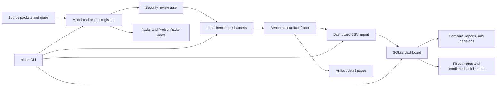

# AI Lab OS Portfolio Case Study

## Summary

AI Lab OS is a local-first Apple Silicon AI lab for evaluating which local
models, model runtimes, and AI-adjacent projects are worth installing, testing,
keeping, or learning from. The project is built around a Mac Studio with 256 GB
unified memory and keeps the default workflow private, auditable, and local.

The dashboard now answers three practical questions from repository-local data:
whether a model is estimated to fit this machine, which confirmed scored model
leads for a task, and how to grow the evidence with an explicitly approved
benchmark batch. Its comparative evidence is intentionally narrow: only Qwen3
Coder and Dolphin-Mistral 24B currently have confirmed scored model evidence.

The product loop is:

```text
source packet -> radar candidate -> security gate -> benchmark artifact
-> raw responses -> confirmed scores -> dashboard import -> comparison
-> keep/watchlist/retest/skip decision
```

## Problem

Local AI evaluation gets unreliable when discovery, installation, benchmark
evidence, scoring, and final decisions are tracked in separate places. The
dashboard originally had useful pieces, but it was easy to confuse demo rows,
installed inventory, radar candidates, and real benchmark results.

AI Lab OS solves that by separating each state:

- Radar candidates are possible models to review, not scores.
- Installed inventory is detected local runtime state, not benchmark evidence.
- Benchmark artifacts preserve raw responses, scores, decisions, and import CSVs.
- Dashboard model rankings come from imported benchmark results only.
- Security review is explicit before new external or specialty models are
  approved for download or execution.

## What Was Built

- A dependency-light model dashboard using Python stdlib HTTP serving, SQLite,
  CSV import/export, inline SVG charts, local reports, and route/action tests.
- A Midnight Neon dashboard redesigned from 11 primary destinations into four
  workflow surfaces: Home, Discover, My Models, and Benchmark. It retains
  reachable detail routes, a collapsible sidebar, offline icons, responsive
  tables/charts, inline-only JavaScript, and no external dashboard assets.
- A Fit Advisor that derives labeled memory estimates from known parameter and
  quantization metadata plus the latest sanitized hardware snapshot. Missing
  metadata stays unknown, and observed tokens/sec appears only when a benchmark
  artifact supplied it.
- Confirmed-score-only task leaders for Coding, Reasoning & agents, Research &
  writing, Long context, and Fast & practical, including visible ties, omission
  when no confirmed scores exist, and an honest single-model warning.
- An AI Lab Radar lane for model candidates and a Project Radar lane for GitHub
  repositories with business, product, learning, or local-runtime relevance.
- An installed-model inventory page that manually checks LM Studio and Ollama,
  separates loaded/indexed/filesystem-only state, and shows local file paths.
- A gated model-removal flow that is disabled by default, requires a two-step
  confirm, constrains paths to local model roots, sends LM Studio folders to
  macOS Trash, and uses `ollama rm` for Ollama.
- A local benchmark harness that preserves evidence, raw responses, scores,
  decisions, and dashboard-compatible CSV artifacts.
- A unified `ai-lab` CLI for local status, radar listing, hardware snapshots,
  benchmark matrix planning, approval-gated benchmark execution, benchmark
  artifact prep, import, report, and dashboard launch.
- An approval-gated `ai-lab bench queue` that preflights and prints an exact
  multi-candidate batch before execution, blocks the whole batch on incomplete
  runtime metadata, continues after individual failures, and reports captured
  status and runtime metrics.
- A read-only `/capability` dashboard page that summarizes hardware profile
  examples, candidate readiness, benchmark artifact counts, score/run signals,
  performance signals, and the next benchmark matrix command.
- Local-first guardrails: no hidden cloud calls, no model downloads from radar,
  no committed secrets, and write actions disabled unless explicitly enabled.
- A real-corpus RAG retrieval evaluation path with local BGE-M3 evidence, plus
  offline answer/citation scoring fixtures and optional local reranker wiring.
- Benchmark runtime metric artifacts and sanitized report rendering, plus an
  offline MLX-LM LoRA experiment scaffold that validates metadata but does not
  train or process private datasets.

## Architecture



## Current Evidence

- Confirmed Qwen3 Coder evidence:
  `data/eval_results/20260605-qwen3-coder-30b-a3b-lmstudio-cli-r1/`
  and the existing scored retest under
  `data/eval_results/20260603-qwen3-coder-30b-a3b-lmstudio-mlx-4bit-r2/`.
- Confirmed Dolphin-Mistral 24B evidence dated 2026-06-25:
  `docs/lab-notes/2026-06-25-dolphin-mistral-v1-benchmark.md`.
- Real-corpus BGE-M3 retrieval evidence:
  `evals/rag-retrieval/corpora/repo-docs-v0.1/bge-m3-metrics.json`, recording
  `recall@5 = 1.0` and `MRR = 1.0` for four queries. The corpus is too small to
  support a general retrieval-quality claim.
- Runtime metric/report methodology:
  `docs/lab-notes/2026-06-26-benchmark-lab-polish.md`.
- MLX-LM metadata-only fine-tuning scaffold:
  `evals/mlx-finetune/` and
  `docs/lab-notes/2026-06-26-mlx-finetune-scaffold.md`.
- Validation gate used for this refresh:
  `python3 -m unittest discover -s apps/model-dashboard/tests`,
  `python3 -m unittest discover -s evals/local-llm-benchmark/tests`,
  `python3 scripts/model_dashboard_smoke.py`, `uv run pytest -q`, and
  `uv run ruff check .`.

## Screenshots

Portfolio screenshots live under `docs/assets/screenshots/`:

- `v1-lab.png`
- `v1-radar.png`
- `v1-projects.png`
- `v1-reports.png`

The dashboard itself is reproducible locally with:

```bash
python3 apps/model-dashboard/run_dashboard.py serve --demo
```

Useful views to capture:

- `/lab` for the product loop.
- `/capability` for readiness and capability context.
- `/radar` for model candidates.
- `/projects` for GitHub project radar.
- `/inventory` for installed-model detection.
- `/reports` for report explanation.

## Security Story

AI Lab OS treats popularity as metadata, not approval. Before a model should be
downloaded or executed, the registry and review artifacts should record:

- provenance and source URL;
- license posture;
- artifact format and runtime path;
- checksum/hash status when available;
- download approval state;
- isolation notes and red flags;
- exact local runtime id before any benchmark run.

The current system keeps external radar metadata separate from registry approval
and keeps candidate-only records separate from eval scores.

Dashboard write actions follow the same posture. Benchmark execution, artifact
import, and model removal are off by default and require explicit server or CLI
approval gates. The delete path is recoverable for LM Studio folders and refuses
client-supplied filesystem paths.

## Engineering Decisions

- Use stdlib-first Python for dashboard and harness paths.
- Keep dashboard render-time behavior local and non-networked.
- Separate demo fixture data from real dashboard views by default.
- Keep run-test and import actions off by default behind explicit server flags.
- Keep model execution behind explicit per-run approval of model id, runner, and
  benchmark run id.
- Scope batch approval to the exact preflight enumeration and refuse the full
  queue before execution if any selected candidate lacks required local runtime
  metadata.
- Derive task leaders only from confirmed score rows; exclude drafts and keep
  ties and low-sample states visible.
- Keep fit estimates visibly separate from observed benchmark throughput and
  return unknown instead of filling missing parameter or quantization metadata.
- Avoid model downloads, cloud SDKs, API keys, telemetry, and hidden network
  calls.
- Store benchmark evidence as inspectable local JSONL, JSON, CSV, and Markdown.

## Current Limits

- Cross-model comparison and task leaders are backed by only two unique
  confirmed models, Qwen3 Coder and Dolphin-Mistral 24B. More model families are
  needed before treating the results as broadly representative.
- Fit classifications are deterministic capacity estimates, not measured
  per-model memory use. Imported tokens/sec remains the observed signal.
- Performance charts are first-class dashboard views, but live values depend on
  imported benchmark artifacts containing `tokens_per_sec`, `ttft_seconds`, and
  `total_latency_seconds`.
- The BGE-M3 retrieval result is perfect only on a tiny four-query repo-docs
  corpus and should be expanded before drawing retrieval-quality conclusions.
- The MLX-LM fine-tuning lane is an offline scaffold; no local training result or
  adapter quality claim exists yet.

## Next Skill Plan

1. Benchmark breadth: add confirmed model families beyond the current two-model
   evidence set, only after exact local ids and security approval.
2. Hardware calibration: compare Fit Advisor estimates with sanitized observed
   benchmark memory evidence.
3. Runtime comparison: benchmark LM Studio, Ollama, MLX/MLX-LM, and llama.cpp
   where approved and practical.
4. RAG quality: expand the four-query repo-docs corpus and citation-quality evals.
5. Fine-tuning: run no MLX-LM experiment until dataset, base model, local paths,
   baseline eval, and operator approval are recorded.
