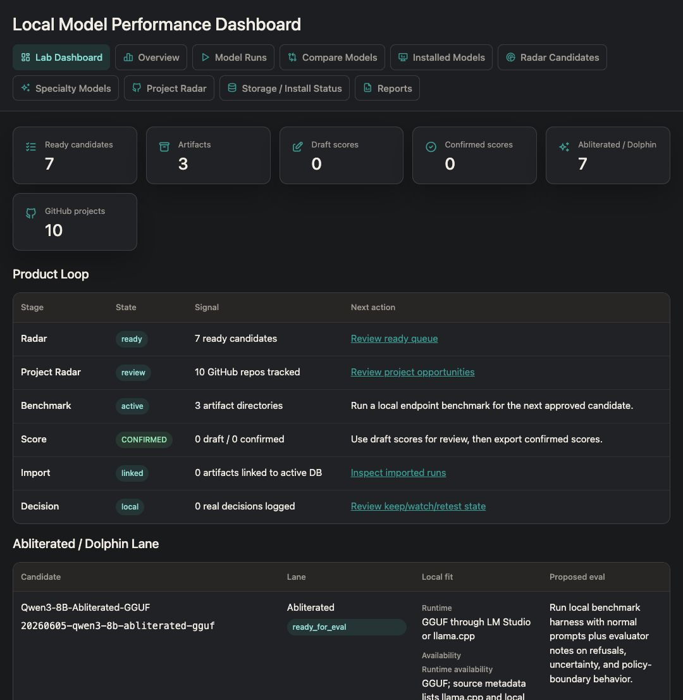
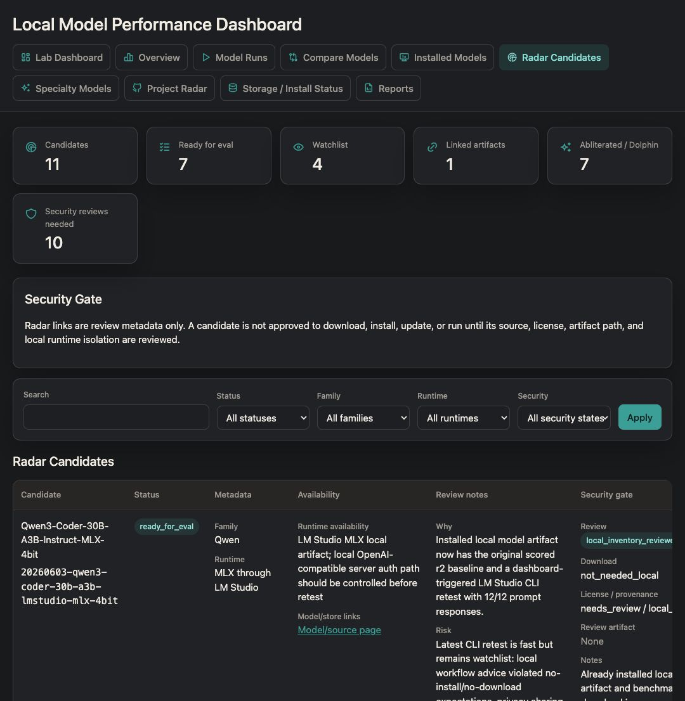
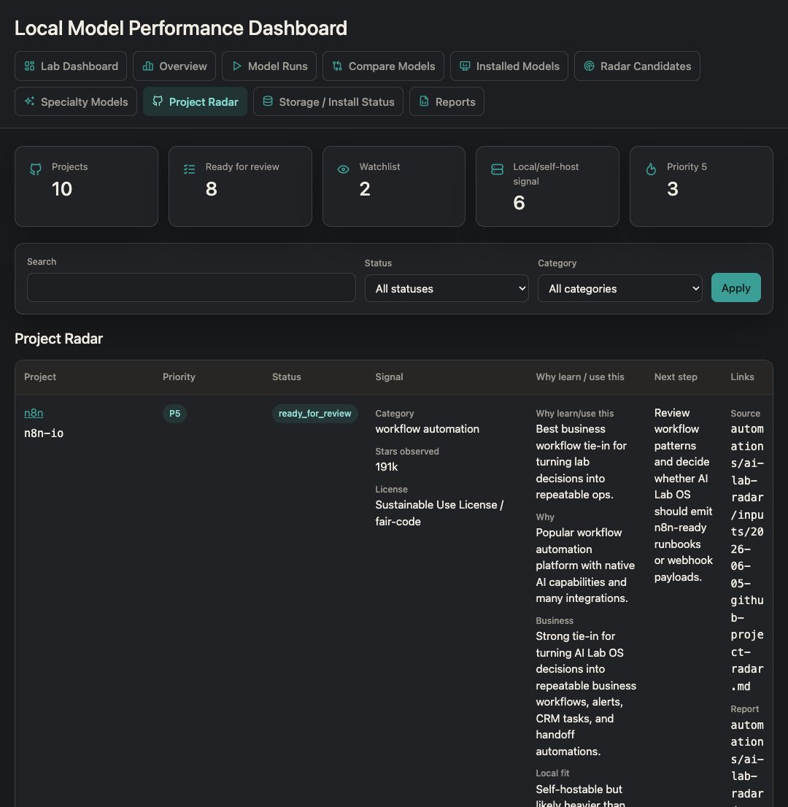
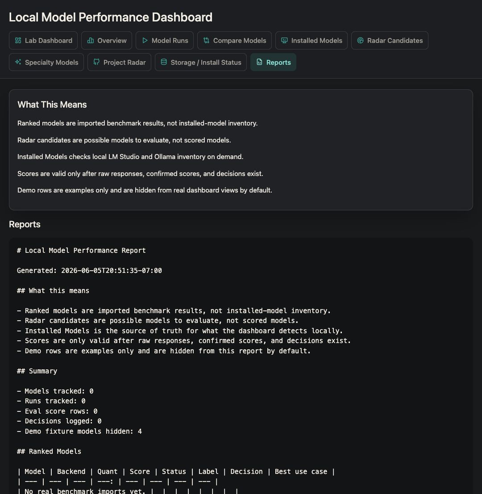

# AI Lab OS Portfolio Case Study

## Project Summary

AI Lab OS is a local-first evaluation and decision system for personal AI
infrastructure on Apple Silicon. It helps answer a practical question:

```text
Which local models and AI projects are worth installing, testing, keeping,
or learning from?
```

The system combines model radar, security review, local benchmark artifacts,
confirmed scoring, dashboard import, model comparison, and final keep/watchlist/
retest/skip decisions. It is designed for a Mac Studio with 256 GB unified
memory, while keeping the default operating model private and local.

## Problem

Local AI work can get messy quickly:

- Model recommendations arrive from Hugging Face, GitHub, LM Studio, Ollama,
  blog posts, and community notes.
- Installed inventory is not the same thing as benchmarked performance.
- Demo rows can be mistaken for real local models.
- Security due diligence is easy to skip when a model looks popular.
- Raw benchmark responses, scoring, and final decisions often drift apart.

AI Lab OS turns that into a traceable workflow:

```text
candidate -> security gate -> benchmark artifact -> raw responses -> confirmed scores
-> dashboard import -> comparison -> decision
```

## What Was Built

- Local model dashboard with lab, radar, specialty, project, inventory, runs,
  compare, reports, artifacts, and storage views.
- Candidate registry for local and external radar sources.
- Project radar for GitHub repositories that may connect to business, product,
  automation, or learning goals.
- Local benchmark harness with raw response preservation, evidence notes,
  score templates, decision records, and dashboard CSV export.
- Security gate for provenance, license, artifact format, checksum, runtime
  path, and approval state.
- Manual installed-model inventory checks for LM Studio and Ollama.
- Fixture/demo data isolation so demo rankings are not confused with installed
  local models.
- HTTP handler tests for dashboard routes and POST action safeguards.
- Ruff lint coverage widened to include dashboard, benchmark harness, and smoke
  scripts.

## Current Evidence

- Real scored benchmark: `Qwen3-Coder-30B-A3B-Instruct-MLX-4bit`
- Confirmed dashboard artifact:
  `data/eval_results/20260605-qwen3-coder-30b-a3b-lmstudio-cli-r1/`
- Validation suite:
  - `uv run ruff check .`
  - `uv run ruff format --check .`
  - `python3 -m unittest discover -s apps/model-dashboard/tests`
  - `python3 -m unittest discover -s evals/local-llm-benchmark/tests`
  - `python3 scripts/model_dashboard_smoke.py`
  - `uv run pytest`

## Product Screenshots

These screenshots show dashboard UX and workflow structure. Demo rows may appear
in screenshot views when the dashboard is launched with `--demo`; benchmark
claims still require real artifacts and confirmed scores.









## Architecture

See [architecture-v1.md](architecture-v1.md) for the full diagram.

At a high level:

```text
source packets
  -> candidate/project registries
  -> security review
  -> local benchmark harness
  -> dashboard CSV import
  -> SQLite dashboard
  -> reports and decisions
```

## Engineering Decisions

- Local-first by default: no hidden cloud calls, no model downloads from radar,
  and no committed secrets.
- Candidate claims do not become scores. Scores require raw responses and a
  confirmed scoring artifact.
- Demo data is hidden from real views by default.
- Run-test and import actions are disabled unless explicitly enabled by server
  flags.
- Dashboard remains dependency-light and uses stdlib server/SQLite/CSV paths.
- External radar produces review packets first; registry entry requires user
  approval.

## Security Story

The model recommendation workflow treats popularity as context, not trust.
Before a model can be approved for download or execution, it needs review of:

- provenance
- license
- artifact format
- checksum/hash evidence
- runtime path
- install/update approval
- red flags such as custom code, untrusted scripts, notebooks, or unclear
  publisher chains

This is important because the project is intentionally designed for large local
models and specialty/low-refusal candidates, where download and runtime safety
matter.

## Measurable Outcomes

- Real scored local benchmark captured and imported.
- Dashboard distinguishes installed inventory, radar candidates, demo fixtures,
  benchmark artifacts, model runs, and final decisions.
- Full test suite currently passes with 95 tests.
- Lint now covers the previously excluded dashboard and benchmark paths.
- Portfolio-ready screenshots and documentation are available in-repo.

## Next Product Milestones

1. Add a second real confirmed benchmark so Compare becomes genuinely useful.
2. Finish Dolphin-Mistral 24B security/runtime approval or choose another exact
   installed model.
3. Tag `v1.0.0` after either the second benchmark lands or the release is
   explicitly defined as a single-model baseline.
4. Add an import-ready page or safe local import button as a v1.1 improvement.
5. Add retrieval evaluation fixtures for the RAG lane.
