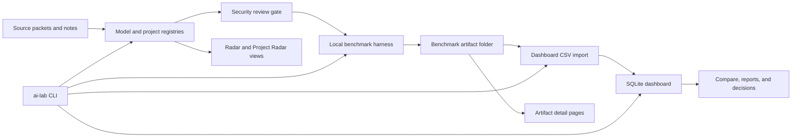

# AI Lab OS Portfolio Case Study

## Summary

AI Lab OS is a local-first Apple Silicon AI lab for evaluating which local
models, model runtimes, and AI-adjacent projects are worth installing, testing,
keeping, or learning from. The project is built around a Mac Studio with 256 GB
unified memory and keeps the default workflow private, auditable, and local.

The product loop is:

```text
source packet -> radar candidate -> security gate -> benchmark artifact
-> raw responses -> confirmed scores -> dashboard import -> comparison
-> keep/watchlist/retest/skip decision
```

## Problem

Local AI evaluation gets unreliable when discovery, installation, benchmark
evidence, scoring, and final decisions are tracked in separate places. The
dashboard originally had useful pieces, but it was easy to confuse demo rows,
installed inventory, radar candidates, and real benchmark results.

AI Lab OS solves that by separating each state:

- Radar candidates are possible models to review, not scores.
- Installed inventory is detected local runtime state, not benchmark evidence.
- Benchmark artifacts preserve raw responses, scores, decisions, and import CSVs.
- Dashboard model rankings come from imported benchmark results only.
- Security review is explicit before new external or specialty models are
  approved for download or execution.

## What Was Built

- A dependency-light model dashboard using Python stdlib HTTP serving, SQLite,
  CSV import/export, inline SVG charts, local reports, and route/action tests.
- A Midnight Neon dashboard redesign with a collapsible left sidebar, offline
  icons, inline-only JavaScript for the sidebar toggle, and no external assets.
- An AI Lab Radar lane for model candidates and a Project Radar lane for GitHub
  repositories with business, product, learning, or local-runtime relevance.
- An installed-model inventory page that manually checks LM Studio and Ollama,
  separates loaded/indexed/filesystem-only state, and shows local file paths.
- A gated model-removal flow that is disabled by default, requires a two-step
  confirm, constrains paths to local model roots, sends LM Studio folders to
  macOS Trash, and uses `ollama rm` for Ollama.
- A local benchmark harness that preserves evidence, raw responses, scores,
  decisions, and dashboard-compatible CSV artifacts.
- A unified `ai-lab` CLI for local status, radar listing, hardware snapshots,
  benchmark matrix planning, approval-gated benchmark execution, benchmark
  artifact prep, import, report, and dashboard launch.
- A read-only `/capability` dashboard page that summarizes hardware profile
  examples, candidate readiness, benchmark artifact counts, score/run signals,
  performance signals, and the next benchmark matrix command.
- Local-first guardrails: no hidden cloud calls, no model downloads from radar,
  no committed secrets, and write actions disabled unless explicitly enabled.

## Architecture



## Current Evidence

- Confirmed local benchmark artifact:
  `data/eval_results/20260605-qwen3-coder-30b-a3b-lmstudio-cli-r1/`
- Existing scored Qwen retest artifact:
  `data/eval_results/20260603-qwen3-coder-30b-a3b-lmstudio-mlx-4bit-r2/`
- Current dashboard validation:
  - `python3 -m unittest discover -s apps/model-dashboard/tests`
    - 75 tests pass.
  - `python3 -m unittest discover -s evals/local-llm-benchmark/tests`
    - 8 tests pass.
  - `python3 scripts/model_dashboard_smoke.py`
    - Dashboard smoke passes.
  - `uv run pytest -q`
    - 149 tests pass.
  - `uv run ruff check .`
    - All checks pass.

## Screenshots

Portfolio screenshots live under `docs/assets/screenshots/`:

- `v1-lab.png`
- `v1-radar.png`
- `v1-projects.png`
- `v1-reports.png`

The dashboard itself is reproducible locally with:

```bash
python3 apps/model-dashboard/run_dashboard.py serve --demo
```

Useful views to capture:

- `/lab` for the product loop.
- `/capability` for readiness and capability context.
- `/radar` for model candidates.
- `/projects` for GitHub project radar.
- `/inventory` for installed-model detection.
- `/reports` for report explanation.

## Security Story

AI Lab OS treats popularity as metadata, not approval. Before a model should be
downloaded or executed, the registry and review artifacts should record:

- provenance and source URL;
- license posture;
- artifact format and runtime path;
- checksum/hash status when available;
- download approval state;
- isolation notes and red flags;
- exact local runtime id before any benchmark run.

The current system keeps external radar metadata separate from registry approval
and keeps candidate-only records separate from eval scores.

Dashboard write actions follow the same posture. Benchmark execution, artifact
import, and model removal are off by default and require explicit server or CLI
approval gates. The delete path is recoverable for LM Studio folders and refuses
client-supplied filesystem paths.

## Engineering Decisions

- Use stdlib-first Python for dashboard and harness paths.
- Keep dashboard render-time behavior local and non-networked.
- Separate demo fixture data from real dashboard views by default.
- Keep run-test and import actions off by default behind explicit server flags.
- Keep model execution behind explicit per-run approval of model id, runner, and
  benchmark run id.
- Avoid model downloads, cloud SDKs, API keys, telemetry, and hidden network
  calls.
- Store benchmark evidence as inspectable local JSONL, JSON, CSV, and Markdown.

## Current Limits

- A second unique confirmed model benchmark is still needed for stronger
  cross-model comparison.
- Performance charts are first-class dashboard views, but live values depend on
  imported benchmark artifacts containing `tokens_per_sec`, `ttft_seconds`, and
  `total_latency_seconds`.
- RAG retrieval quality evaluation still needs fixtures and scoring.

## Next Skill Plan

1. Hardware profiling: keep sanitized snapshots tied to benchmark evidence.
2. Local eval design: improve scoring rubrics and draft-score review flow.
3. Runtime comparison: benchmark LM Studio, Ollama, MLX/MLX-LM, and llama.cpp
   when exact local model ids are approved.
4. RAG quality: add retrieval eval fixtures and citation-quality checks.
5. Portfolio publishing: capture screenshots, tag a release, and keep resume
   bullets tied to committed evidence.
